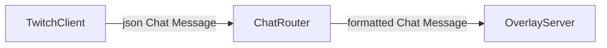

# openBSChat

openBSChat (short for **open Browser Source Chat**) is a C# application for displaying and Formatting Livestream Chat using Browser Source. Whilst intended for OBS it is entirely agnostic by Design.

For now only Twitch via Twitch EventSub is supported but support for  Legacy tmi.js as well as Youtube LiveChat is planned.

## Connecting your Twitch Channel
Edit `appsettings.json` and add your ClientID and specify the Channel.
For local development i recommended creating an `appsettings.Development.json` with the same Contents.

## Building
After cloning the Repository:
`dotnet restore`
`dotnet build`

## Architecture

This Program follows a simple Pipeline Principle where each component has a single responsibility.

## License
This Software is licensed under the GNU Affero General Public License v3.0 (AGPL-3.0). See `LICENSE` for details.

